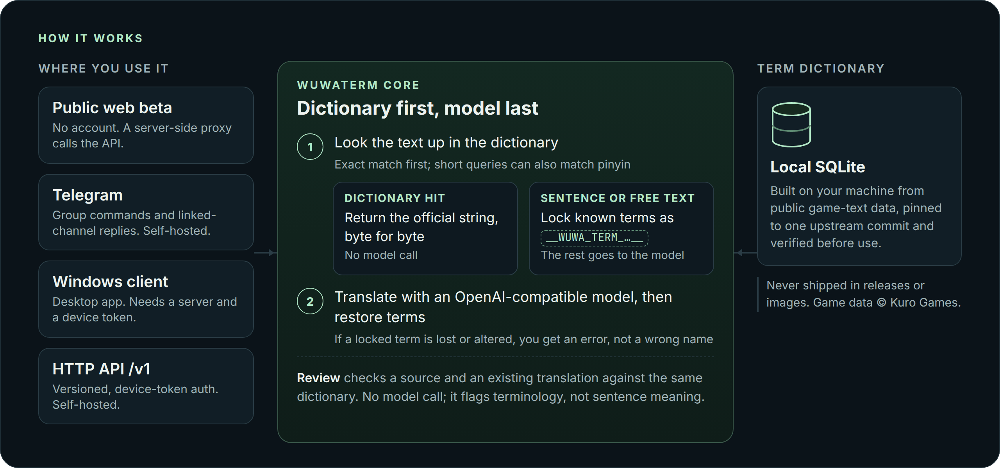

  

  Official Chinese and English terminology for the game Wuthering Waves (鸣潮): look up a term, translate a sentence without the names getting paraphrased, or check a translation you already have.
   
  查询《鸣潮》中英官方术语，整句翻译时保留官方译名，并用词典核对已有译文。

  <a href="https://wuwaterm.denia-official.chatgpt.site"><b>Try&nbsp;the&nbsp;public&nbsp;beta</b></a>&nbsp;·
  <a href="#run-your-own"><b>Self-host</b></a>&nbsp;·
  <a href="#windows-client">Windows&nbsp;client</a>&nbsp;·
  <a href="#http-api">HTTP&nbsp;API</a>&nbsp;·
  <a href="docs/README.md">Docs</a>
   
  <b>English</b> · <a href="README.zh-CN.md">简体中文</a>

  
  
  
  

> [!NOTE]
> WuwaTerm is an unofficial, independent fan project. It is not affiliated with, authorized by, or endorsed by Kuro Games, and it uses no official game art. Wuthering Waves game data and in-game terminology are © Kuro Games.

## Why WuwaTerm

WuwaTerm is for anyone who reads or writes about Wuthering Waves across Chinese and English: fan translators, guide and wiki writers, and community admins.

A general-purpose translator sees game names as ordinary words, so an official name can come back paraphrased, or rendered differently from one sentence to the next. WuwaTerm checks a dictionary built from the game's own text data first. When the whole query is a term, you get the dictionary's official string back byte for byte, with no model involved. When it is a sentence, the matching terms are locked before any text reaches a language model and put back unchanged afterwards.

  
   
  The public beta, captured 2026-09-13. Its interface is in Chinese, and you can type in either language. 声骸 is listed twice because the game uses the term in two categories.

## What you can do

- **Look up a term in either direction.** Type Chinese or English and get the official pair. Short romanised queries such as `shenghai` can also match by pinyin.
- **Translate a sentence with the names locked.** The direction is detected from the script, or you choose it. If a locked term goes missing or comes back altered, you get an error instead of a wrong name.
- **Review a translation you already have.** Paste the source and your translation; WuwaTerm shows which official terms are confirmed and which need a look, and offers the official pair for each. It checks terminology only, not sentence meaning, and never calls a model.
- **Pick up where you left off.** The review workbench saves your draft as a manuscript file on your own computer, and you import it later to continue. There are no accounts and no cloud copy of your manuscript.

  
   
  Review on the public beta: “Jinhsi” is confirmed; no official rendering of 声骸 is found in the translation, so the workbench offers “Echo”. Where it had to shorten a candidate list, the report says so instead of claiming a complete check. The image is cropped.

### Where it runs

| Surface | What it does | What you need |
| --- | --- | --- |
| Public web beta | Lookup, translation, review, manuscript files | A browser |
| Telegram bot | Lookup, translation, auto-translating a linked channel | Your own server and bot token |
| Windows client | Lookup, translation | A server address and device token |
| HTTP API | Lookup, translation, review | Your own server |

Outside the public beta, sentence translation also needs an OpenAI-compatible model configured on the server.

## How it works

Telegram commands and the HTTP API share one dictionary-first application layer, and the public beta and the Windows client reach it through the API. Linked-channel auto-translation has its own orchestration over the same dictionary lookup and term locking. The terminology database is a local SQLite file you build from a pinned public copy of the game's text data; it is never shipped in a release or container image. The model is optional: without one, dictionary lookups still work. Modules, trust boundaries and request flows are mapped in [Architecture](docs/architecture.md).

## Get started

### Try it now

Open the [public beta](https://wuwaterm.denia-official.chatgpt.site). There is no sign-up. The interface is in Chinese, but you can type English, and lookups show both languages. Everyone shares the same first-come daily limits, counted separately for lookups, translations and reviews and reset at 00:00 UTC, so it can be busy or run out, and there is no SLA. Please do not paste personal or sensitive text. Limits are in [Public Beta Site](docs/sites.md) and privacy details in [Privacy and LLM](docs/privacy-and-llm.md#anonymous-public-beta-site).

### Run your own

The [self-hosting guide](docs/self-hosting.md) goes from a checkout at a release tag to a first lookup: Docker Compose on Linux (or Python 3.11+ from source), about 2 GB of disk for the upstream data, and your own Telegram bot token and OpenAI-compatible endpoint if you want those features.

### Windows client

Download `WuwaTerm-<client version>-windows-x64.zip` from the [latest release](https://github.com/My-Denia/wuwa-translate-bot/releases/latest), not the “Source code” archive. It is a portable, unsigned build, so Windows SmartScreen asks you to choose “More info” and then “Run anyway”. The client talks to a WuwaTerm server through its API and needs a device token from whoever runs that server; it does not connect to the public beta. See the [client guide](client/README.md) (in Chinese).

### Telegram bot

There is no shared public bot. Run the bot on your own server with your own BotFather token, then authorize the groups it may serve.

| You send | The bot replies with |
| --- | --- |
| `/tr 声骸` | `Echo` |
| `/tr Echo` | `声骸` |
| `/tr --to en 今汐装备了声骸` | the sentence in English, names locked |

Commands, group authorization and linked-channel auto-translation are covered in [Telegram Behavior](docs/telegram-behavior.md).

### HTTP API

Versioned `/v1` routes cover terms, translations and reviews, each authenticated with a revocable device token. The committed contract is [`docs/api/openapi.json`](docs/api/openapi.json), and the self-hosting guide walks through a [first lookup and translation](docs/self-hosting.md#first-lookup-first-translation).

## Documentation

| For users | For self-hosters | For contributors |
| --- | --- | --- |
| [Public Beta Site](docs/sites.md) | [Self-Hosting](docs/self-hosting.md) | [Contributing](CONTRIBUTING.md) |
| [Windows client](client/README.md) (in Chinese) | [Support Matrix](docs/support-matrix.md) | [Architecture](docs/architecture.md) |
| [Telegram Behavior](docs/telegram-behavior.md) | [Data Refresh](docs/data-refresh.md) | [Decision records](docs/adr/README.md) |
| [Privacy and LLM](docs/privacy-and-llm.md) | [HTTP API contract](docs/api/openapi.json) | [Validation](docs/validation.md) |

Every guide is listed in the [documentation index](docs/README.md).

## Under the hood

- **Python 3.11+** with python-telegram-bot (long polling) and FastAPI, over a SQLite dictionary that the serving containers mount read-only.
- **Architecture rules that CI enforces**: the application layer imports no presentation code, and the API contract is drift-checked against a committed OpenAPI snapshot ([ADR 0009](docs/adr/0009-http-api-adapter.md)).
- **Revocable device credentials** for the API, stored only as salted scrypt verifiers ([ADR 0010](docs/adr/0010-device-principal-authentication.md)).
- **Transactional updates** in the maintainer's deployment tooling: the new image, and for data updates a candidate database, is verified before the running service is touched, and an ordinary failure restores the previous image, database and commit pointer ([ADR 0008](docs/adr/0008-candidate-verification-and-transactional-deployment.md)).
- **A Windows client** in PySide6 that holds no translation logic ([ADR 0011](docs/adr/0011-pc-client-stack.md)), and **a public beta** built as a Cloudflare Worker that proxies the same API.

## Project status

WuwaTerm is a personal hobby project, maintained on a best-effort basis. The latest tagged release is on the [Releases page](https://github.com/My-Denia/wuwa-translate-bot/releases); `main` moves ahead of it, and [CHANGELOG.md](CHANGELOG.md) marks what is unreleased. The public beta promises no fixed availability or response time. Where to ask questions and what to expect is in [SUPPORT.md](SUPPORT.md).

## Contributing

- **Getting a wrong result?** Open a [bug report](https://github.com/My-Denia/wuwa-translate-bot/issues/new/choose) with your query, what WuwaTerm returned and what the game shows. A term that is wrong in the game data itself has to be fixed upstream ([SUPPORT.md](SUPPORT.md)).
- **Want to change code or docs?** Read [CONTRIBUTING.md](CONTRIBUTING.md). Local validation has one entry point: `python scripts/validate.py`.
- **Found a security problem?** Report it privately as described in [SECURITY.md](SECURITY.md).

## License and data

The source code is released under the [MIT License](LICENSE), © 2026 My-Denia. The license covers this project's code only. Wuthering Waves game data and in-game terminology are © Kuro Games and are not redistributed here: the dictionary is built on your own machine from a pinned public data source, as described in [Data Refresh](docs/data-refresh.md). The WuwaTerm logo and the images in this README are original to this project or screenshots of its own interface, and contain no game art ([asset notes](docs/assets/README.md)).
