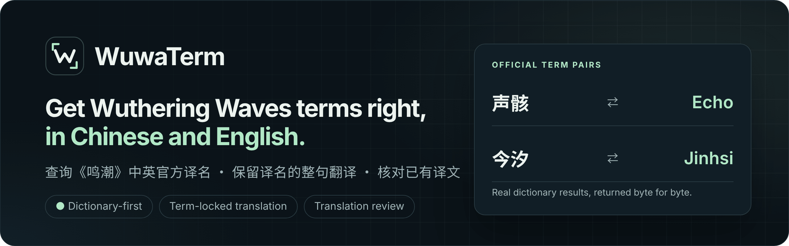
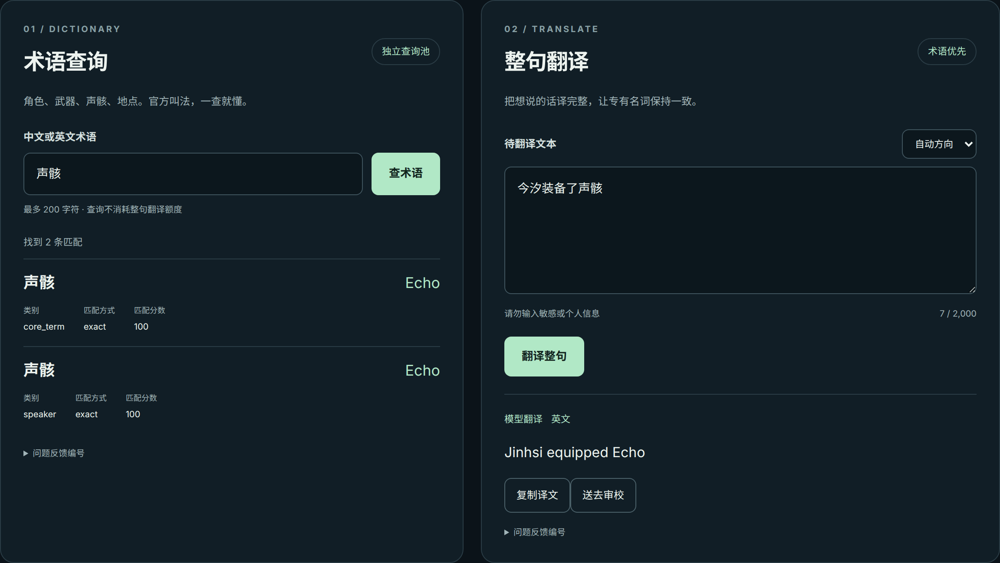
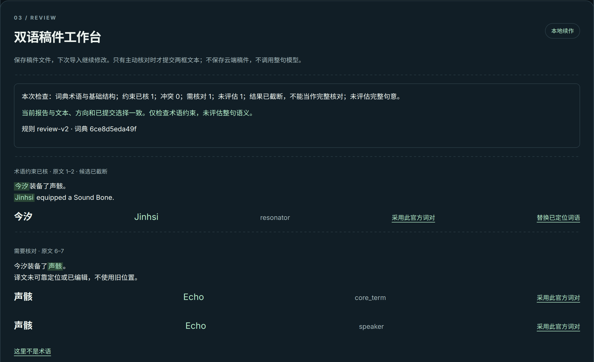
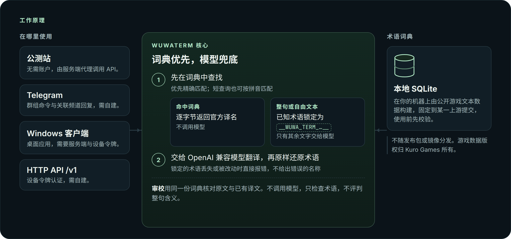

  

  查询《鸣潮》中英官方术语，整句翻译时保留官方译名，并用词典核对已有译文。

  <a href="https://wuwaterm.denia-official.chatgpt.site"><b>立即试用公测站</b></a>&nbsp;·
  <a href="#自建部署"><b>自建部署</b></a>&nbsp;·
  <a href="#windows-客户端">Windows&nbsp;客户端</a>&nbsp;·
  <a href="#http-api">HTTP&nbsp;API</a>&nbsp;·
  <a href="docs/README.md">文档</a>
   
  <a href="README.md">English</a> · <b>简体中文</b>

  
  
  
  

> [!NOTE]
> WuwaTerm 是非官方、独立的玩家自制开源项目，与 Kuro Games 无隶属、授权或背书关系，也不使用任何官方游戏美术素材。《鸣潮》游戏数据与游戏内术语的版权归 Kuro Games 所有。

## 为什么需要 WuwaTerm

WuwaTerm 面向需要在中英文之间阅读或书写《鸣潮》内容的人：同人译者、攻略与 wiki 作者，以及社群管理员。

通用翻译工具把游戏专有名词当作普通词语，官方译名可能被意译，同一个名字在不同句子里也可能译法不一。WuwaTerm 会先查一遍词典（由游戏自身的文本数据构建）：整条输入就是术语时，逐字节返回词典中的官方写法，不经过模型；输入是整句时，先锁定其中匹配到的术语，再把文字交给语言模型，译完后原样放回。

  
   
  公测站界面，截于 2026-09-13。“声骸”出现两次，是因为游戏在两个类别中使用了这个术语。

## 能做什么

- **双向查术语**：输入中文或英文，得到官方中英对照；也支持 `shenghai` 这样的简短拼音查询。
- **锁定术语的整句翻译**：自动判断中译英或英译中，也可以手动指定。模型返回的译文里如果锁定的术语丢失或被改动，请求会直接报错，不会给出被改写的名称。
- **审校已有译文**：粘贴原文和你的译文，WuwaTerm 标出哪些术语约束已核、哪些需要核对，并给出每处对应的官方词对。它只检查术语，不评判整句含义，也不调用模型。
- **在本地保存稿件**：双语稿件工作台把稿件保存为你电脑上的文件，下次导入即可继续。没有账户，也没有云端稿件。

  
   
  公测站上的双语稿件工作台：“Jinhsi”术语约束已核；译文中找不到“声骸”的官方译法，于是给出“Echo”。候选列表被截短时，报告会明确标出，不当作完整核对。图片有裁剪。

### 各入口支持的功能

| 入口 | 能做什么 | 需要准备 |
| --- | --- | --- |
| 公测站 | 查术语、整句翻译、审校、稿件文件 | 浏览器 |
| Telegram bot | 查术语、整句翻译、关联频道自动翻译 | 自己的服务器和 bot token |
| Windows 客户端 | 查术语、整句翻译 | 服务端地址和设备令牌 |
| HTTP API | 查术语、整句翻译、审校 | 自己的服务器 |

公测站以外的整句翻译，还需要服务端配置 OpenAI 兼容模型。

## 工作原理

Telegram 命令与 HTTP API 共用同一个词典优先的应用层，公测站与 Windows 客户端都经由 API 访问它；关联频道自动翻译有自己的编排，但使用同一套词典查询与术语锁定。术语数据库是一份本地 SQLite 文件，由你用固定版本的公开游戏文本数据自行构建，不随任何发布包或容器镜像分发。模型是可选的：没有模型时，词典查询照常可用。模块划分、信任边界与请求流程见[架构文档](docs/architecture.md)。

## 开始使用

### 马上试用

打开[公测站](https://wuwaterm.denia-official.chatgpt.site)，无需注册。术语查询、整句翻译和审校的每日额度分别计数，由所有人共用、先到先用，每天 UTC 00:00（北京时间 08:00）重置；可能繁忙或当天用完，不保证随时可用。请不要粘贴个人或敏感信息。详见站内的[共享额度](https://wuwaterm.denia-official.chatgpt.site/limits)与[隐私说明](https://wuwaterm.denia-official.chatgpt.site/privacy)，运营细节见[公测站说明](docs/sites.md)。

### 自建部署

[自建部署指南](docs/self-hosting.md)（英文）从检出发布 tag 一直讲到第一次查词。需要 Linux 上的 Docker Compose（或从源码运行 Python 3.11+）、约 2 GB 磁盘存放上游数据；如需 bot 或整句翻译，还要准备自己的 Telegram bot token 和 OpenAI 兼容接口。

### Windows 客户端

从[最新发布](https://github.com/My-Denia/wuwa-translate-bot/releases/latest)下载 `WuwaTerm-<客户端版本>-windows-x64.zip`，不要下载“Source code”压缩包。客户端是免安装版，没有代码签名，Windows SmartScreen 会拦截，需要依次点“更多信息”和“仍要运行”。客户端通过 API 连接 WuwaTerm 服务端，需要服务运营者发放的设备令牌，不能直接连接公测站。详见[客户端说明](client/README.md)。

### Telegram bot

目前没有公开可用的 bot。请用自己的 BotFather token 在自己的服务器上运行 bot，再授权它可以服务的群组。

| 发送 | bot 回复 |
| --- | --- |
| `/tr 声骸` | `Echo` |
| `/tr Echo` | `声骸` |
| `/tr --to en 今汐装备了声骸` | 英文整句，术语保持锁定 |

命令、群组授权与关联频道自动翻译见 [Telegram 行为](docs/telegram-behavior.md)。

### HTTP API

版本化的 `/v1` 路由覆盖术语、翻译与审校，统一使用可吊销的设备令牌认证。仓库内的接口契约文件是 [`docs/api/openapi.json`](docs/api/openapi.json)，自建部署指南里有[第一次查词与翻译](docs/self-hosting.md#first-lookup-first-translation)的完整示例。

## 文档

以下文档目前以英文为主；客户端说明和少数设计、审计记录是中文。

| 使用者 | 自建部署者 | 贡献者 |
| --- | --- | --- |
| [公测站说明](docs/sites.md) | [自建部署](docs/self-hosting.md) | [贡献指南](CONTRIBUTING.md) |
| [Windows 客户端](client/README.md) | [支持矩阵](docs/support-matrix.md) | [架构](docs/architecture.md) |
| [Telegram 行为](docs/telegram-behavior.md) | [数据刷新](docs/data-refresh.md) | [架构决策记录](docs/adr/README.md) |
| [隐私与 LLM](docs/privacy-and-llm.md) | [HTTP API 契约](docs/api/openapi.json) | [校验](docs/validation.md) |

全部指南都列在[文档索引](docs/README.md)中。

## 技术实现

- **Python 3.11+**，使用 python-telegram-bot（长轮询）与 FastAPI，服务容器以只读方式挂载 SQLite 词典。
- **由 CI 强制的架构约束**：应用层不导入任何表示层代码；CI 会比对 API 契约与仓库中的 OpenAPI 快照，检查是否漂移（[ADR 0009](docs/adr/0009-http-api-adapter.md)）。
- **可吊销的设备凭据**：API 凭据只以加盐 scrypt 校验值保存（[ADR 0010](docs/adr/0010-device-principal-authentication.md)）。
- **事务式更新**：维护者自用的部署工具先校验新镜像（数据更新时还有候选数据库），通过后才动运行中的服务；常规失败会恢复之前的镜像、数据库与提交指针（[ADR 0008](docs/adr/0008-candidate-verification-and-transactional-deployment.md)）。
- **Windows 客户端**用 PySide6 实现，自身不含翻译逻辑（[ADR 0011](docs/adr/0011-pc-client-stack.md)）；**公测站**以 Cloudflare Worker 形式构建，代理访问同一套 API。

## 项目状态

WuwaTerm 是个人业余项目，按尽力而为的方式维护。最新正式版本见 [Releases 页面](https://github.com/My-Denia/wuwa-translate-bot/releases)；`main` 分支会领先于正式版本，未发布的变更记录在 [CHANGELOG.md](CHANGELOG.md)。公测站不承诺固定可用性或响应时间。提问渠道与响应预期见 [SUPPORT.md](SUPPORT.md)。

## 参与贡献

- **查询结果不对**：请[提交问题报告（Bug report）](https://github.com/My-Denia/wuwa-translate-bot/issues/new/choose)，写明查询内容、WuwaTerm 的返回和游戏内的写法。游戏数据本身有误的术语需要在上游修正（见 [SUPPORT.md](SUPPORT.md)）。
- **想改代码或文档**：先读 [CONTRIBUTING.md](CONTRIBUTING.md)。本地校验只有一个入口：`python scripts/validate.py`。
- **发现安全问题**：请按 [SECURITY.md](SECURITY.md) 的方式私下报告。

## 许可与数据

源代码以 [MIT 许可证](LICENSE)发布，© 2026 My-Denia。该许可只覆盖本项目的代码。《鸣潮》游戏数据与游戏内术语的版权归 Kuro Games 所有，本仓库不做再分发：词典按[数据刷新](docs/data-refresh.md)中的说明，在你自己的机器上由固定版本的公开数据源构建。WuwaTerm 标志与本 README 中的图片均为本项目原创或其自身界面的截图，不含任何游戏美术素材（[素材说明](docs/assets/README.md)）。
